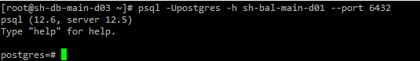
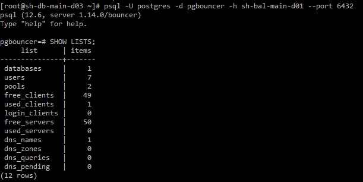

# PgBouncer

## Установка

```
yum install pgbouncer
systemctl start pgbouncer
systemctl enable pgbouncer
firewall-cmd --permanent --add-port=6432/tcp
firewall-cmd --reload
```

где порт, который мы указываем в файле конфига.

На сервере с Postgres запускаем запрос, чтобы получить текущих пользователей БД:

```
SELECT CONCAT('"',pg_shadow.usename, '" "', passwd, '"') FROM pg_shadow;
```

Копируем результат запроса, на сервер pgbouncer в файл /etc/pgbouncer/userlist.txt

Для проверки подключения используем slave postgres, от-туда подключимся через пуллер к БД:

```
psql -Upostgres -h sh-bal-main-d01 --port 6432
```



## Статистика

У pgbouncer есть своя такблица с статистикой, чтобы пдключится к ней, c slave postgres, нужно выполнить команду:

```
psql -U postgres -d pgbouncer -h sh-bal-main-d01 --port 6432
```

И посмотреть в таблицу SHOW LISTS;



Есть команда -

```
SHOW HELP;
```

## Крнфиг (pgbouncer.ini)

```
[databases]
;; fallback connect string
* = host=SH-DB-MAIN-D01
[pgbouncer]
;; IP address or * which means all IPs
listen_addr = *
listen_port = 6432
;; any, trust, plain, md5, cert, hba, pam
;;md5 - запрашивает пароль
;;trust - открывает соеденение без пароля
auth_type = md5
auth_file = /etc/pgbouncer/userlist.txt
;; comma-separated list of users who are allowed to change settings
admin_users = postgres

;; comma-separated list of users who are just allowed to use SHOW command
stats_users = stats, postgres

;; When server connection is released back to pool:
;;   session      - after client disconnects (default)
;;   transaction  - after transaction finishes
;;   statement    - after statement finishes
pool_mode = session

;; Query for cleaning connection immediately after releasing from
;; client.  No need to put ROLLBACK here, pgbouncer does not reuse
;; connections where transaction is left open.
server_reset_query = DISCARD ALL

;; Comma-separated list of parameters to ignore when given in startup
;; packet.  Newer JDBC versions require the extra_float_digits here.
ignore_startup_parameters = extra_float_digits

;; Total number of clients that can connect
max_client_conn = 3000

;; Default pool size.  20 is good number when transaction pooling
;; is in use, in session pooling it needs to be the number of
;; max clients you want to handle at any moment
default_pool_size = 100
```